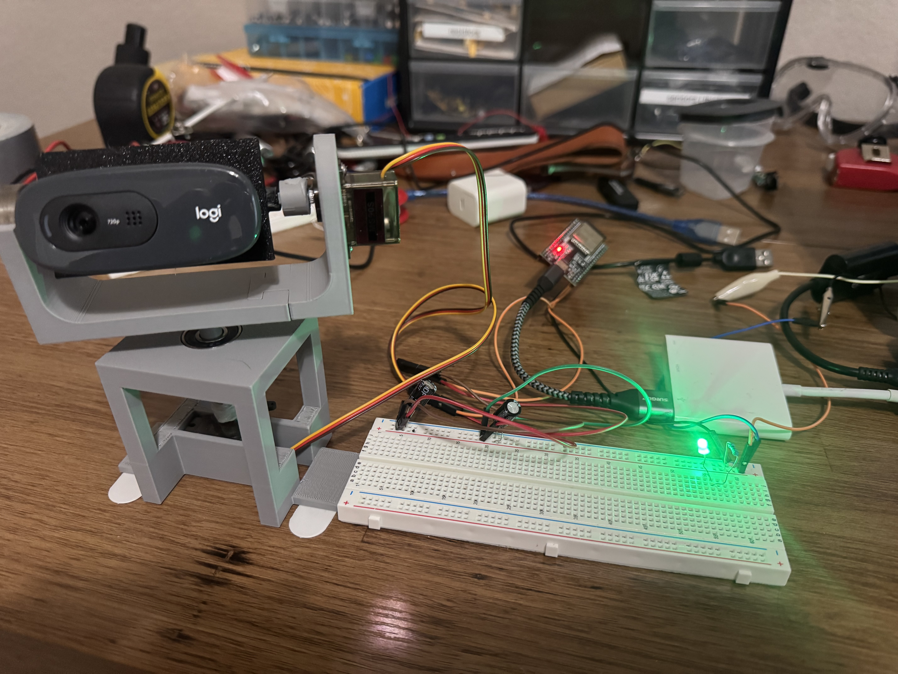
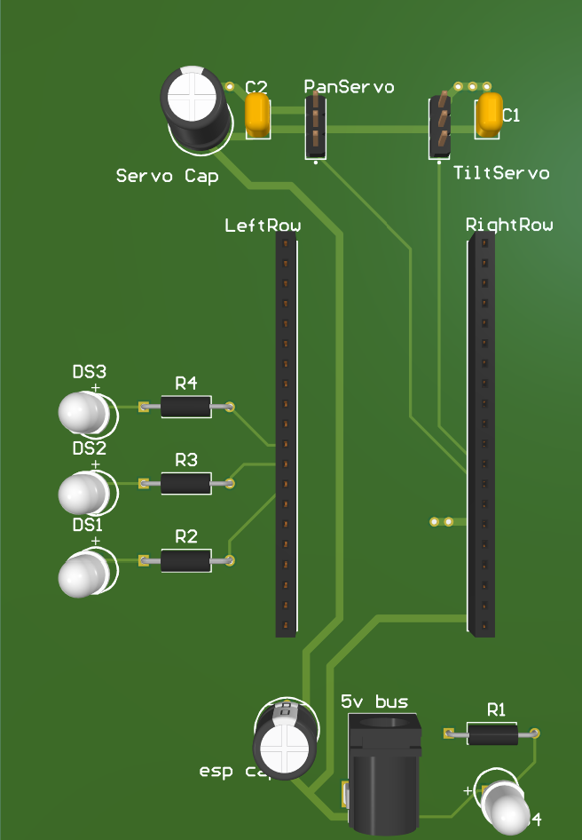
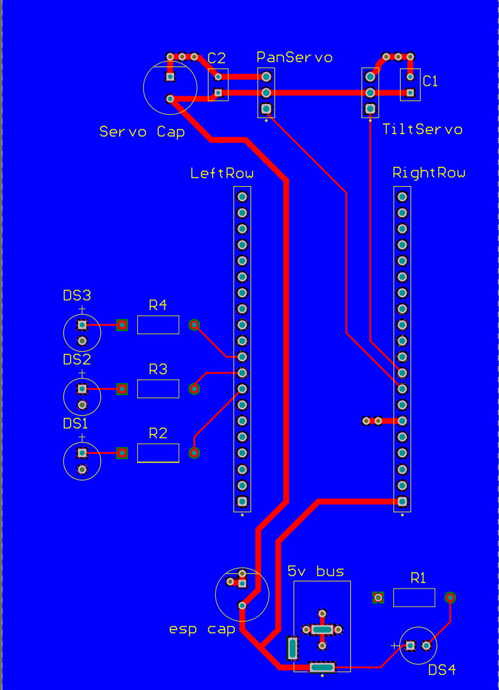

# Face Tracking Camera Mount
A webcam based face tracker that drives a two axis servo rig in real time using OpenCV and PID control loop.

## Demo
Camera POV: https://youtu.be/18pSnaqJ_sk
View of rig: https://youtu.be/09SmcJm5nH4

## Overview

Aims a webcam to track a person's face, designed for someone speaking to
the camera at close to medium range. OpenCV detects and locates the face,
and a PID control loop calculates the needed movement of the two servos
(pan/tilt). Detection and PID run on a laptop, which sends commands via
serial to an ESP32 that drives the servos.

## Software

- Face detection model parameters were chosen by benchmarking accuracy
  against latency on a recorded test video. A custom benchmark script 
  was written to sweep through all combinations of parameters and track 
  accuracy and latency metrics. The top combinations were then selected and reviewed.
- PID gains were tuned by hand.

## Hardware & Power Supply

- Servos are powered by a custom power supply to prevent their current
  draw from causing a brownout. Capacitors are placed by the servos to 
  accomdate any sudden current draws.
- A PCB has been designed in Altium for the project but not fabricated due to cost.
  It includes a barrel jack and capacitors for smooth power delivery, pin
  headers to mount the ESP32, and status LEDs for the power supply and
  face detection state.

## Future Improvements

**Battery power option** — the power supply could be changed to support running off a battery, removing the need for a wall outlet.
**Facial recognition** — a face recognition model could be added so the rig locks onto a specific known face rather than just the largest one in frame.
**Predictive tracking** — motion-based prediction of where a face is heading was considered during development, but deemed unnecessary for this project's scope given the responsiveness already achieved through PID tuning.
**Self-contained hardware** — the image processing could be moved onto a Raspberry Pi (or similar single-board computer) so the system no longer depends on a laptop. This would likely require re-tuning the detection parameters, since embedded hardware has less processing headroom than a laptop CPU, and latency would need to stay under the ~33ms budget of a 30fps frame rate.

## Additional Content

